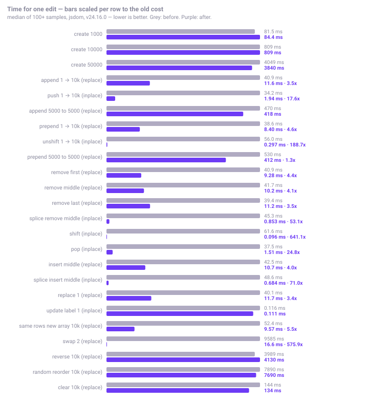
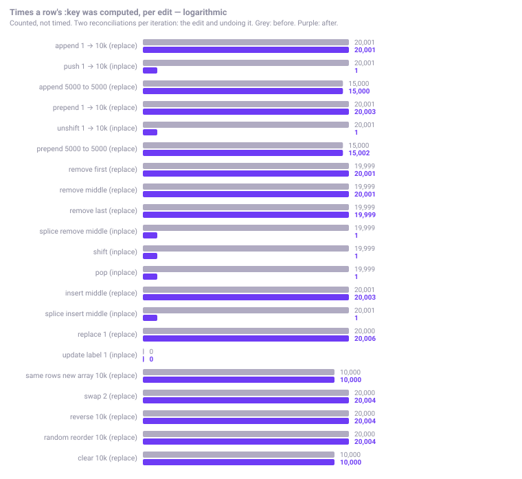
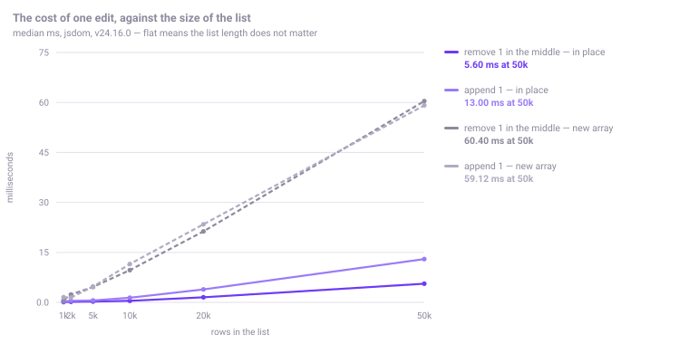
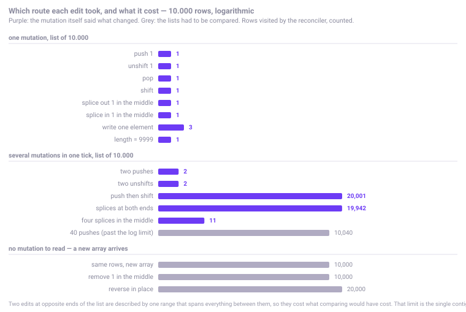
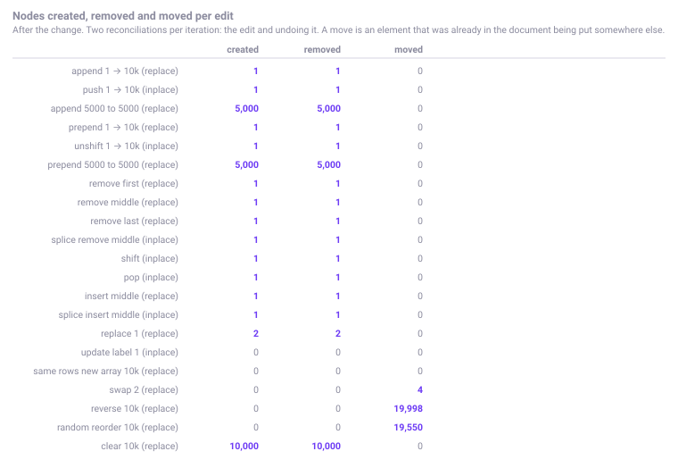
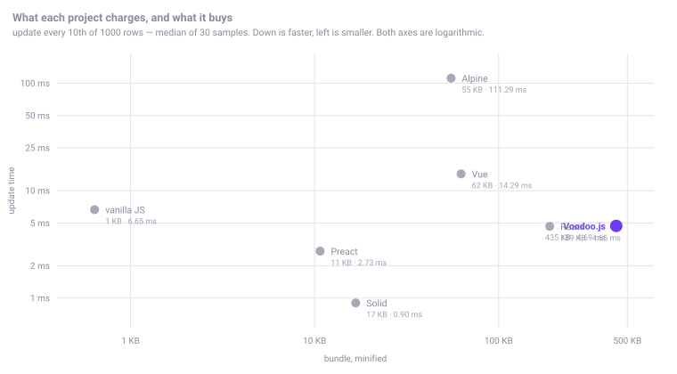
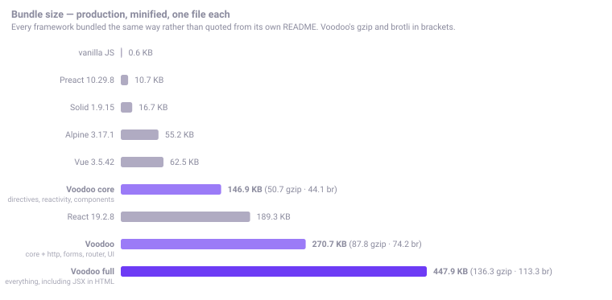
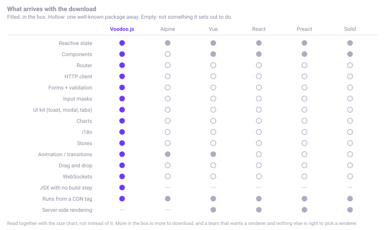

<div align="center">


### JSX, running from a plain `.html` file.

**Write JSX. Save the file. Open it in a browser. There is nothing in between.**

No bundler · No JSX transform · No runtime dependencies · No configuration required

[](https://github.com/kwy404/Voodoo.js/actions/workflows/ci.yml)
[](LICENSE)
[](#typescript)
[](https://www.npmjs.com/package/voodoojs)
[](https://www.npmjs.com/package/voodoojs)
[](packages/voodoojs/dist/voodoo.full.min.js)


*JavaScript feels like magic.*

**[Website](https://kwy404.github.io/Voodoo.js/) · [Playground](https://kwy404.github.io/Voodoo.js/playground.html) · [Components](https://kwy404.github.io/Voodoo.js/components.html) · [Examples](https://kwy404.github.io/Voodoo.js/examples/) · [Documentation](https://kwy404.github.io/Voodoo.js/docs/)**

Everything above runs in the browser, built with Voodoo.js itself.

[JSX in plain HTML](#jsx-in-plain-html) · [Install](#installation) · [Quick start](#quick-start) · [Benchmarks](#performance) · [Contributing](#contributing) · [Português](README.pt-BR.md)

</div>

## JSX in plain HTML

Save this as `index.html` and open it. There is no build step, no bundler, no
compiler and no JSX transform.

```html
<!doctype html>
<html>
<head>
  <script src="https://cdn.jsdelivr.net/npm/voodoojs@0.13.0/dist/voodoo.full.min.js" defer></script>
</head>
<body>

{
  const user = 'Ana';
  const fruits = ['apple', 'pear', 'grape'];
}

<h1>Hello, {user}!</h1>

<ul>
  {fruits.map((fruit) => (
    <li>{fruit}</li>
  ))}
</ul>

</body>
</html>
```

That is the differentiator. Every other way to write JSX needs a toolchain
between the file you edit and the file the browser loads. This one *is* the file
the browser loads.

| To render the list above | What it takes |
| --- | --- |
| React | npm install, a bundler, Babel or SWC, a build, a dev server |
| Preact | npm install, a bundler, a JSX transform — or `htm`, which is not JSX |
| Solid | npm install, a bundler, its own compiler; JSX is not optional |
| Vue | npm install, a bundler, `@vitejs/plugin-vue` — or hand-written render functions |
| Svelte | npm install, a bundler, the Svelte compiler — and it is not JSX |
| **Voodoo.js** | **one `<script>` tag** |

The honest cost, stated up front: those toolchains compile JSX down to direct
DOM calls ahead of time, and Voodoo reads it at runtime. A compiler will beat an
interpreter on raw update throughput and always will — the [benchmarks](#performance)
below show exactly where and by how much. What you get back is a file you can
open, edit and send to someone without a `node_modules` directory existing
anywhere in the story.

Conditionals return elements the way they do in JSX, and one way they do not:

```html
<p>{loggedIn ? <b>Welcome back</b> : <b>Please sign in</b>}</p>
<p>{loggedIn && <b>Only when true</b>}</p>

<p>
  {if (level === 1) (<b>one</b>)
   else if (level === 2) (<b>two</b>)
   else (<b>something else</b>)}
</p>
```

A real `if / else if / else` that returns elements is not something JSX itself
offers.

Callbacks have real bodies, so branching per item reads the way you would write
it anywhere else:

```html
<ul>
  {products.map(item => {

    if (item.stock === 0) {
      return (<li>{item.name}: out of stock</li>);
    }

    const label = item.stock > 6 ? 'plenty' : 'a few';
    return (<li>{item.name}: {label}</li>);

  })}
</ul>
```

It is reactive. A region is an effect, so `items.push(...)` re-renders the list,
and it composes with everything else: `v-data`, `@click`, `v-model`, stores.

### How it can possibly work

The browser has already parsed the page, and what it leaves behind is
recoverable. For the list above the DOM is three siblings: the text
`{fruits.map((fruit) => (`, the element `<li>{fruit}</li>`, and the text `))}`.
The element is not damage to route around, it is the template. Rejoining the
text with a placeholder where the element sat reconstructs the expression
exactly as it was typed, and it then runs through the same lexer, parser and
interpreter as every other expression. Nothing is compiled and nothing is
evaluated as a string, so it still works under a strict Content Security Policy.

### The two rules that keep it out of your way

A region is only claimed when an **element** sits inside the braces. `{ count }`
on its own is ordinary interpolation, and a stray `{` in prose never balances.

And `script`, `style`, `pre`, `code`, `samp`, `kbd`, `textarea`, `template` and
`noscript` are never scanned, so a page full of example code stays a page full
of example code.

### There is no `style={{ ... }}`. Bind the attribute

```html
<div :style="{ backgroundColor: color }">    <!-- this is the way -->

<div style="{{ backgroundColor: color }}">   <!-- does nothing -->
<div style={{ backgroundColor: color }}>     <!-- does nothing -->
```

An earlier version of this file marked the middle line as working. It does not:
a plain `style` attribute is never treated as an expression, because only `v-*`,
`:` and `@` attributes are read. The braces survive verbatim as a nonsense CSS
declaration and the element renders unstyled. A colon in front, and the ordinary
binding does exactly what was intended.

The last line fails twice over, and the second reason applies to every
attribute: an unquoted value ends at the first space, so the browser turns it
into six separate attributes before any script has run, lowercasing their names
on the way. Quote your attribute values.

**[Try all ten examples in the playground](https://kwy404.github.io/Voodoo.js/playground.html)**

---

## The 30-second version

Save this file. Open it in a browser. It works.

```html
<script src="voodoo.full.min.js" defer></script>

<div v-data="{ count: 0 }">
  <button @click="count--">-</button>
  <strong>{ count }</strong>
  <button @click="count++">+</button>
</div>
```

No bundler, no build step, no config file, no JSX. Just HTML that thinks.

### The same idea, doing real work

Reactive state, a live HTTP request, a validated form and a toast notification — still one script
tag, still no build step:

```html
<div v-data="{ }">

  <!-- A request with its own loading / error / data state, declared in HTML -->
  <div v-resource="users: /api/users">
    <p v-if="users.loading">Loading…</p>
    <p v-else-if="users.error">{ users.error.message }</p>
    <ul v-else>
      <li v-for="user in users.data" :key="user.id">{ user.name }</li>
    </ul>
    <button @click="users.reload()">Refresh</button>
  </div>

  <!-- A form that validates, submits over AJAX and reports back -->
  <form v-submit="/api/users" v-method="POST" v-validate
        v-toast-success="User created" v-reset-success>
    <input name="name" v-required>
    <input name="email" type="email" v-required v-email>
    <button type="submit" :disabled="$form.loading">
      { $form.loading ? 'Saving…' : 'Save' }
    </button>
  </form>

</div>
```

That is the whole application. There is no companion `app.js` doing the wiring.

## What is Voodoo?

React and Vue start from JavaScript: you describe the UI in a component language, and HTML is what
the framework produces at the end.

**Voodoo starts from HTML.** The page you already have *is* the application. You add attributes to
it, each attribute is bound to reactive state, and when that state changes only the DOM nodes that
depend on it are updated — nothing else is touched, and there is no Virtual DOM in between.

When HTML is not enough, the `V` API is right there: `V.reactive`, `V.component`, `V.http`,
`V.store`, `V.router`, and a chainable DOM collection through `V('#selector')`. You can write an
entire application in JavaScript with `V.createApp().mount('#app')` if you prefer. Same runtime,
and the two modes mix freely in one page.

This is not a "React killer". It is a different starting point for a different kind of project:
server-rendered admin panels, content sites, prototypes, legacy pages, and anything where adding a
build pipeline costs more than the problem you are solving.

## Why Voodoo?

- **JSX with no toolchain.** `{items.map(i => <li>{i}</li>)}` renders from a `.html` file
  opened straight off disk. No bundler, no transform, no build.
- **HTML-first.** Behavior lives next to the markup it belongs to. One file, not three.
- **Fine-grained reactivity.** Proxy-based `reactive` / `ref` / `computed` / `effect`. A write
  re-runs only the effects that actually read that value.
- **No mandatory build step.** One `<script>` tag is a complete setup. A build is available when
  you want one, never required.
- **Zero runtime dependencies.** The browser bundles ship nothing but Voodoo.
- **Direct DOM updates.** No Virtual DOM: an effect writes to the node it owns. Lists are the
  one place a diff is unavoidable, and `v-for` uses the mutation you performed — `push`,
  `splice`, `shift` — to touch only the rows it changed. See [performance](#performance).
- **Secure expression parser.** Attribute expressions go through a real lexer, a Pratt parser and
  an AST interpreter. No `eval`, no `new Function` — so Voodoo runs under a Content Security
  Policy without `unsafe-eval`.
- **Progressive enhancement.** Voodoo never takes over the page: it enhances the elements you mark
  and leaves the rest alone, so it drops into existing codebases without a rewrite.
- **Batteries included.** Reactivity, components, router, HTTP, forms, validation, masks, UI,
  drag-and-drop, animation, charts, i18n and stores are in the box — not in twelve packages.
- **TypeScript.** The whole source is TypeScript and every entry point ships declarations.
- **Optional tooling.** A CLI exists for scaffolding and custom builds. You never have to use it.

## Two ways to write it

**Mode 1 — HTML.** State declared where it is used:

```html
<div v-data="{ count: 0 }">
  <button @click="count++">Clicked { count } times</button>
</div>
```

**Mode 2 — JavaScript.** The same reactivity engine, driven from your own code:

```js
const state = V.reactive({ count: 0 })
V.effect(() => { document.title = `Count: ${state.count}` })
state.count++
```

## Batteries included

Every row below is part of the shipped runtime.

| Pillar | What you get |
| --- | --- |
| **Reactivity** | `reactive`, `ref`, `computed`, `effect`, `watch`, `watchEffect`, `nextTick`, `effectScope`, `flushSync` |
| **Expressions** | Own lexer + Pratt parser + AST interpreter. No `eval`, CSP-friendly |
| **Directives** | Text, conditionals, lists, binding, classes, styles, events, refs, transitions and more |
| **Components** | Props, state, computed, methods, watchers, template, scoped style, named slots, `provide`/`inject`, lifecycle |
| **App mode** | `V.createApp({…}).mount('#app')` with `use`, `provide`, local components and `unmount` |
| **DOM** | Chainable collection via `V('#selector')`, plus transition helpers |
| **HTTP** | Interceptors, timeout, exponential retry, cache, CSRF, upload progress, SSE, NDJSON streaming, offline queue |
| **Declarative requests** | `v-get`/`v-post`/`v-put`/`v-patch`/`v-delete`, `v-resource`, `v-load`, `v-load-visible`, `v-search`, polling |
| **Forms** | AJAX submit, serialization, upload, dropzone, autosave, leave guard, reactive `$form` state |
| **Validation & masks** | Full rule set, async rules, custom rules and messages, input masks |
| **Stores** | `V.store(name, def, { persist })` and the `$store` magic, with optional `localStorage` persistence |
| **Storage** | `storage`, `session`, `cookie`, `cache`, `url`, `theme` |
| **UI** | Toast, modal, alert, confirm, prompt, dialog, command palette, plus directives for tabs, dropdowns, tooltips, drawers, popovers and accordions |
| **Drag and drop** | `v-draggable`, `v-droppable`, `v-sortable`, groups, keyboard support |
| **Router** | History and hash modes, params, query, guards, scroll restoration, view cache, `v-link`, `v-router-view`, dynamic routes |
| **i18n** | Locale messages, `V.t`, `v-t`, pluralization, runtime locale switching |
| **Motion** | Spring physics, stagger, `inView`, scroll progress, presets |
| **Charts** | Rendered as plain SVG, no charting dependency |
| **Realtime** | `V.socket` over native WebSocket and the Socket.IO protocol, public and private rooms, backoff reconnection, heartbeat and a send queue. Declarative via `v-socket`, `v-room` and `v-on-socket:` |
| **GPU** | `V.gpu` over WebGPU with WGSL reflection, plus the `v-shader` directive. Without WebGPU it falls back to the canvas content |
| **Devtools** | `V.xray` reactivity inspector and an event bus |
| **CLI** | `voodoojs-cli`: `init`, `build --modules=…`, `add`, `info` |

## Installation

**A script tag, and nothing to install**

```html
<script src="https://cdn.jsdelivr.net/npm/voodoojs@0.13.0/dist/voodoo.full.min.js" defer></script>
```

That is the whole installation. The library starts itself once the page is ready.
[unpkg](https://unpkg.com/voodoojs@0.13.0/dist/voodoo.full.min.js) serves the same file if you prefer it.

The tag above names an exact version, so what you load never changes under you and the page tells
you which build it is. Use the `0.11` line instead if you would rather patch releases arrived on
their own. It is the FULL build, which is the one that carries JSX; drop `.full` for the essential
build, 84 KB gzipped against 132, if you do not need it.

**npm**

```bash
npm install voodoojs
```

```js
import V from 'voodoojs'
V.start()

// or import only what you need — separate entry points, ESM and CJS, with types
import { reactive, computed } from 'voodoojs/reactivity'
import { http } from 'voodoojs/http'
import { debounce } from 'voodoojs/utils'
```

**Vendor the file, or build it yourself**

For pages that must not reach a third-party host, or an air-gapped network:

```bash
curl -O https://cdn.jsdelivr.net/npm/voodoojs@0.13.0/dist/voodoo.full.min.js
# or build from source
git clone https://github.com/kwy404/Voodoo.js.git
cd Voodoo.js && npm install && npm run build   # bundles land in packages/voodoojs/dist/
```

```html
<script src="voodoo.full.min.js" defer></script>
```

**CLI**

```bash
npx voodoojs-cli init my-page                          # scaffold a ready-to-open project
npx voodoojs-cli build --modules=core,directives,http  # custom bundle with only what you use
npx voodoojs-cli add card                              # copy a component into your project
npx voodoojs-cli info                                  # list modules and their sizes
```

**Which bundle?**

| File | Contents |
| --- | --- |
| `voodoo.core.min.js` | Minimal build: reactivity, expressions, directives, components, DOM, requests |
| `voodoo.min.js` | **Essential build — the default.** Adds forms, validation, masks, UI, drag-and-drop |
| `voodoo.full.min.js` | Everything: charts, motion, router, i18n, devtools, ready-made components |

Sizes are dynamic — see the badge above, or run `npm run size` / `npx voodoojs-cli info`.

## Quick start

**State, events and two-way binding.** Interpolation uses single braces: `{ expression }`.
`{{ expression }}` is accepted too, if you are coming from Vue.

```html
<div v-data="{ name: 'World', email: '' }">
  <p>Hello, { name }!</p>
  <button @click="name = 'Voodoo'">Change</button>

  <input v-model="email" type="email">
  <p v-show="email">You typed: { email }</p>
</div>
```

**Conditionals, lists, classes and styles.**

```html
<div v-data="{ status: 'ready', items: ['one', 'two'], width: 60 }">
  <p v-if="status === 'loading'">Loading…</p>
  <p v-else-if="status === 'error'">Something went wrong.</p>
  <p v-else>Done.</p>

  <li v-for="(item, index) in items" :key="index">{ index + 1 }. { item }</li>

  <span :class="{ 'is-active': status === 'ready' }" :style="{ width: width + '%' }"></span>
</div>
```

**HTTP without writing fetch, and a component.**

```html
<button v-get="/api/stats" v-target="#panel" v-swap="innerHTML">Load</button>
<div id="panel"></div>

<script>
  V.component('user-card', {
    props: { name: { type: 'string', default: 'Anonymous' } },
    template: `<div class="card"><strong v-text="name"></strong></div>`
  })
</script>

<user-card name="Ada"></user-card>
```

## Components

A component is a scope with state, methods, computed values, watchers, props, slots and lifecycle
hooks, mounted over an element. No compile step, no single-file component format.

```js
V.component('counter', {
  props: {
    start: { type: 'number', default: 0 },
    label: { type: 'string', required: true }
  },

  state(props) { return { count: props.start } },

  computed: { doubled() { return this.count * 2 } },

  methods: {
    increment() {
      this.count++
      this.emit('changed', this.count)   // a real bubbling CustomEvent
    }
  },

  watch: { count(value) { console.log('now', value) } },

  template: `
    <button @click="increment()">{ label }: { count }</button>
    <small>doubled: { doubled }</small>
    <slot name="footer"></slot>
  `,

  style: `.counter { font-weight: 600 }`,

  mounted() { /* the element is in the DOM */ }
})
```

Three equivalent ways to use it, and listening to what it emits is a plain event listener:

```html
<div v-component="counter" label="Clicks"></div>
<counter label="Clicks" :start="10" @changed="console.log($event.detail)"></counter>
<Counter label="Clicks"></Counter>
```

Static attributes become string props, coerced to the declared `type`. Attributes written with `:`
are reactive bindings evaluated in the parent scope, and so is slot content; named slots are
matched with `slot="name"`. Inside an instance you also get `$el`, `$props`, `$refs`, `$parent`,
`$name`, `$emit`, `$watch` and `$nextTick`, plus `provide` / `inject` for dependency injection.

**App mode** — if you would rather describe the whole application in JavaScript:

```js
V.createApp({
  data: () => ({ n: 0 }),
  computed: { doubled() { return this.n * 2 } },
  methods: { add() { this.n++ } },
  template: `<button @click="add()">Clicks: { n }</button><p>Doubled: { doubled }</p>`
}).mount('#app')
```

`mount` accepts a target that does not exist yet — it waits for it, so there is no race with page
load. `unmount` restores the container's original HTML instead of leaving it empty.

## HTTP

**Declarative.** Attach a request to an element and say where the response goes:

```html
<button v-get="/api/report" v-target="#out" v-swap="innerHTML">Load</button>

<button v-delete="'/api/users/' + user.id"
        v-confirm="Delete this user?"
        v-toast-success="User deleted">Delete</button>

<div v-get="/api/feed" v-trigger="visible" v-poll="30s"></div>

<input v-search="/api/search" v-param="q" v-debounce="300ms" v-target="#results">
```

The URL may be a literal (`/api/users`) or an expression (`'/api/users/' + id`). Supporting
attributes include `v-target`, `v-swap`, `v-trigger`, `v-poll`, `v-body`, `v-params`, `v-headers`,
`v-cache`, `v-retry`, `v-timeout`, `v-json-path`, `v-template`, `v-offline-queue`, `v-redirect`,
`v-scroll-to`, `v-toast-success`, `v-toast-error`, `v-on-success`, `v-on-error`, `v-on-complete`.

`v-resource` is the version that hands you the request state as reactive data instead of swapping
HTML. It exposes `data`, `loading`, `error`, `loaded`, `reload()` and `set()` — see the demo at the
top of this file.

**Programmatic.**

```js
const users   = await V.http.get('/api/users')
const created = await V.http.post('/api/users', { name: 'Ada' })

// Full response, with status and headers
const res = await V.http.request({ url: '/api/users', retry: 2, timeout: 5000, cache: 60000 })

// Upload with real progress
await V.http.upload('/api/files', formData, { onProgress: (pct) => console.log(pct + '%') })

// Server-Sent Events and NDJSON streaming
V.http.sse('/api/events', { message: (data) => console.log(data) })
await V.http.stream('/api/tokens', (line) => console.log(line))
```

Defaults, interceptors, base URL, CSRF header and cache all live on `V.http.defaults` and
`V.http.interceptors`.

## Forms

Submit, validate, show loading state and report the result — all declared on the form itself:

```html
<form v-submit="/api/contact" v-method="POST" v-validate
      v-toast-success="Message sent" v-toast-error="Could not send" v-reset-success>

  <input name="name" v-required>
  <input name="email" type="email" v-required v-email>
  <input name="phone" v-mask="phone">
  <textarea name="message" v-minlength="20"></textarea>

  <p v-if="$form.errors.email">{ $form.errors.email }</p>

  <button type="submit" :disabled="$form.loading">
    { $form.loading ? 'Sending…' : 'Send' }
  </button>
</form>
```

`$form` is reactive and carries `loading`, `saving`, `success`, `errors`, `message`, `data`,
`status`, `dirty` and `progress`. The rule set covers the usual ground — `required`, `email`,
`url`, `number`, `min`, `max`, `minlength`, `maxlength`, `between`, `match`, `regex`, `date`,
`same`, `different`, `in`, `strongpassword` and more — plus async rules and your own via
`V.validator()`.

## Building full applications

Voodoo scales past a single page without changing the model.

- **Components** — register once, use as tags anywhere on the page.
- **Stores** — `V.store('cart', { items: [] }, { persist: true })`, read anywhere as `$store.cart`.
- **Router** — `V.router({ mode: 'history', routes: { '/users/:id': { component: 'user-page' } } })`,
  with guards, params, scroll behavior, `v-link` and `v-router-view`.
- **Plugins** — `V.use(plugin)` or `app.use(plugin)` to register directives, components and services.
- **Lazy loading** — `v-load-visible` and route `view` records fetch HTML only when it is needed.
- **i18n** — `V.i18n({ locale: 'en', messages })`, then `v-t` in markup and `V.t()` in code.

Each of these has its own guide in [`docs/`](docs/).

## DevTools

The full build ships `xray`, a visual reactivity inspector: it shows the scope tree, live state,
which effects are running, and the event and network logs.

**Press `Ctrl+Shift+F2`.** That is the whole setup. Load the full build and the shortcut is
already listening, whether or not you asked for devtools.

Here is a complete page. Save it, open it, click the button a few times, then press the keys and
watch `count` change in the panel while the button flashes on every write.

```html
<!doctype html>
<html lang="en">
<head>
  <meta charset="utf-8">
  <script src="https://cdn.jsdelivr.net/npm/voodoojs@0.13.0/dist/voodoo.full.min.js" defer></script>
</head>
<body>
  <div v-data="{ count: 0, items: ['a', 'b'] }">
    <button @click="count++">clicked { count } times</button>
    <button @click="items.push('c')">add an item</button>
    <ul><li v-for="i in items">{ i }</li></ul>
  </div>
</body>
</html>
```

It must be `voodoo.full.min.js`. The inspector is not in the core or essential builds, and those
print a line in the console saying so rather than failing silently.

### Opening it from code

```js
V.xray()        // toggle the panel
V.xray(true)    // open it
V.xray(false)   // close it
```

### Changing or removing the shortcut

No key combination is free on every machine, so this one is configurable:

```html
<script src="voodoo.full.min.js" data-xray-shortcut="alt+shift+d" defer></script>
<script src="voodoo.full.min.js" data-xray-shortcut="false" defer></script>
```

```js
V.config.xrayShortcut = 'ctrl+shift+f9';
V.config.xrayShortcut = false;
```

The last part names the **physical** key, so the shortcut behaves the same on every keyboard
layout. `Ctrl+Shift+F2` is the third default: `Ctrl+Shift+X` closes the tab in Opera, and
`Alt+Shift+V` is the Windows keyboard layout switcher, which takes the keys before the page sees
them. `Ctrl+Alt` is unavailable for the same class of reason, being AltGr on Brazilian and most
European layouts.

### The verbose warnings are separate

`data-devtools` is a different switch. It turns on detailed console warnings and mounts the
on-screen widget; it is not needed for the shortcut.

```html
<script src="voodoo.full.min.js" data-devtools defer></script>
```

## Architecture

```
  HTML attributes ─▶  Walker + MutationObserver     finds v-* attributes, builds scopes
                             │
  expressions     ─▶  Lexer → Pratt parser → AST interpreter    no eval, no new Function
                             │
                      Reactivity: Proxy targets + effects       reads tracked, writes queued
                             │
                      Directives update the real DOM nodes      no Virtual DOM, no diff pass

  On top: components · stores · router · HTTP · forms · UI · i18n · motion · charts
```

The long version, including module boundaries and the scope model, is in
[`ARCHITECTURE.md`](ARCHITECTURE.md).

## Performance

The benchmarks are reproducible: pinned dependency versions, production builds, a published
methodology and a recorded environment. The full write-up — including the cases where Voodoo
*loses* — is in [`benchmarks/README.md`](benchmarks/README.md), along with the methodology, the
environment and how to reproduce every measurement.

Vanilla JavaScript is the ceiling here, and Voodoo charges a real cost for the productivity it
buys. The point of these numbers is to show how large that cost is, not to pretend it is zero.

### Lists: what a change actually costs

A `v-for` is one effect over a whole collection, so it is the only place in Voodoo where a diff
exists at all. When the collection changes the effect re-runs, and something has to work out what
that means for `n` rows.

Until 0.13 that decision cost the same whatever had happened. Every row's `:key` went through the
expression interpreter, `normalizeSource` allocated one object per row, three hash structures the
size of the list were built and thrown away, and a placement pass read a DOM property for every
row. Reading the rows through the reactive proxy also subscribed the list to all `n` indices and to
whatever property the key touched on all `n` items, so each re-render first removed the effect from
those dependency sets and added it back — roughly `4n` hash operations before the reconciler had
looked at anything. Removing one row from ten thousand did all of that to conclude that 9,999 rows
had not moved.

0.13 starts from a different question: **what is already known?**

`push`, `pop`, `shift`, `unshift` and `splice` are intercepted where they happen. They now run
against the raw array — a `splice` in the middle no longer fires one proxy trap and one dependency
notification per element it shuffles — and they record what they did. When the list re-renders it
reads that record instead of rediscovering it. `rows.splice(5000, 1)` on ten thousand rows says
exactly one row left, at index 5000, and nothing else is examined.

When there is no record to read — a new array was assigned — the changed region is found by
comparing keys inward from both ends, with the key expression compiled once to a property read
instead of interpreted per row. That costs one property read per row and **cannot be made cheaper**:
to know that row 9,999 did not change you have to look at row 9,999. No fingerprint, block hash or
rolling hash avoids it, because computing the fingerprint of the new list means reading every key in
it first.



| case | before | after | speedup | keys evaluated | allocations |
| --- | ---: | ---: | ---: | ---: | ---: |
| create 1.000 rows | 81.5 ms | 84.4 ms | — | 1,000 → 1,000 | 1,010 → 0 |
| create 10.000 rows | 809 ms | 809 ms | — | 10,000 → 10,000 | 10,010 → 0 |
| create 50.000 rows | 4049 ms | 3840 ms | — | 50,000 → 50,000 | 50,010 → 0 |
| append 1 to 10.000 — new array | 40.9 ms | 11.6 ms | **3.5x** | 20,001 → 20,001 | 20,011 → 0 |
| push 1 onto 10.000 — in place | 34.2 ms | 1.94 ms | **17.6x** | 20,001 → 1 | 20,011 → 0 |
| append 5.000 to 5.000 | 470 ms | 418 ms | **1.1x** | 15,000 → 15,000 | 15,010 → 0 |
| prepend 1 to 10.000 — new array | 38.6 ms | 8.40 ms | **4.6x** | 20,001 → 20,003 | 20,011 → 0 |
| unshift 1 onto 10.000 — in place | 56.0 ms | 0.297 ms | **188.7x** | 20,001 → 1 | 20,011 → 0 |
| prepend 5.000 to 5.000 | 530 ms | 412 ms | **1.3x** | 15,000 → 15,002 | 15,010 → 0 |
| remove the first of 10.000 — new array | 40.9 ms | 9.28 ms | **4.4x** | 19,999 → 20,001 | 20,009 → 0 |
| remove the middle of 10.000 — new array | 41.7 ms | 10.2 ms | **4.1x** | 19,999 → 20,001 | 20,009 → 0 |
| remove the last of 10.000 — new array | 39.4 ms | 11.2 ms | **3.5x** | 19,999 → 19,999 | 20,009 → 0 |
| splice out the middle of 10.000 — in place | 45.3 ms | 0.853 ms | **53.1x** | 19,999 → 1 | 20,009 → 0 |
| shift the first off 10.000 — in place | 61.6 ms | 0.096 ms | **641.1x** | 19,999 → 1 | 20,009 → 0 |
| pop the last off 10.000 — in place | 37.5 ms | 1.51 ms | **24.8x** | 19,999 → 1 | 20,009 → 0 |
| insert 1 in the middle of 10.000 — new array | 42.5 ms | 10.7 ms | **4.0x** | 20,001 → 20,003 | 20,011 → 0 |
| splice 1 into the middle of 10.000 — in place | 48.6 ms | 0.684 ms | **71.0x** | 20,001 → 1 | 20,011 → 0 |
| replace 1 of 10.000 with a new key | 40.1 ms | 11.7 ms | **3.4x** | 20,000 → 20,006 | 20,010 → 6 |
| change 1 label in 10.000 | 0.116 ms | 0.111 ms | — | 0 → 0 | 0 → 0 |
| re-assign an identical 10.000-row array | 52.4 ms | 9.57 ms | **5.5x** | 10,000 → 10,000 | 10,005 → 0 |
| swap 2 rows in 10.000 | 9585 ms | 16.6 ms | **575.9x** | 20,000 → 20,004 | 20,010 → 6 |
| reverse 10.000 rows | 3989 ms | 4130 ms | — | 20,000 → 20,004 | 20,010 → 6 |
| shuffle 10.000 rows | 7890 ms | 7690 ms | — | 20,000 → 20,004 | 20,010 → 6 |
| clear a 10.000-row list | 144 ms | 134 ms | — | 10,000 → 10,000 | 10,010 → 0 |

Time is the symptom; the counters are the cause. The reconciler counts what it does — rows visited,
keys evaluated, writes sent through a reactive proxy, nodes created, removed and moved — and the
benchmark collects those in a second pass with the timers off, so instrumentation never lands inside
a measured number.



The two families are worth reading apart, because they have different floors. A list mutated in
place gets an answer that does not depend on its length; a list replaced wholesale pays one key read
per row no matter how clever the algorithm is. Same edit, same DOM, different information available.



Which route an edit takes is not something a correctness test can show you — a fast path that
quietly falls back still passes every one of them. So it is counted too, including the shapes where
the fast route does not apply:



And what reaches the DOM. A reconciler that reuses every element can still be slow if it drags them
all across the list to get there; a longest-increasing-subsequence pass over the surviving rows
decides which may stay where they are, and it runs only when rows actually crossed each other, so no
insertion, removal or append ever pays for it.



**What each path costs.** `n` is the length of the list, `k` the rows the edit touched, `r` the size
of the changed region.

| Path | When | Cost |
| --- | --- | --- |
| mutation, insert or remove | `push` / `pop` / `shift` / `unshift` / `splice` on a keyed list | O(k) |
| mutation, batch | several mutations in one tick | O(r), r = the range they jointly span |
| scan, then insert or remove | a new array, one localised edit | O(n) key reads + O(k) work |
| scan, then reorder | a new array, rows crossed | O(n) key reads + O(r log r) |
| unkeyed, any change | no `:key` | O(n) — position *is* the identity, so every row after the edit genuinely changed |
| `reverse` / `sort` in place | no range describes the result | O(n) + O(n log n) |

The largest number in that table is not an algorithmic win at all — it is a bug the counters found.
Swapping two rows of ten thousand took **9,585 ms**, and the reason was 19,994 DOM moves: the old
placement pass walked the list backwards, and the first row that did not line up made every row
after it fail the same check, so a two-row swap dragged the whole list along with it. It moves 2
rows now, and takes 16.6 ms.

**Where it does not help, stated plainly.**

*Reversing and shuffling are unchanged* — 3,989 ms against 4,130 ms, and 7,890 against 7,690. Both
already moved close to the minimum: reversing a list requires moving all but one of its rows however
the diff is computed, and what the clock measures there is `insertBefore` into a ten-thousand-child
parent, not the reconciler. A better algorithm cannot save work the DOM insists on doing.

*Creating a list is unchanged* for the same reason. `create 50.000` is the cost of inserting 50,000
nodes; the reconciler is a rounding error beside it.

*Two edits at opposite ends cost what comparing costs.* The changed region is one contiguous range,
so pushing one row and shifting another — the shape of a rolling log — produces a range spanning
everything between them. Correct, and no faster than the scan. Splitting it into several disjoint
regions would fix that case; it is not implemented, because it is real complexity for a shape none
of these benchmarks measured.

*Lists without `:key` identify rows by position*, so removing the first row genuinely changes every
row after it and there is nothing to skip.

The full method, the counters and how to reproduce any of it are in
[`benchmarks/README.md`](benchmarks/README.md); the algorithm and its invariants are in
[`ARCHITECTURE.md`](ARCHITECTURE.md#5-list-reconciliation).

### Tearing a list down

`v-if` and `v-for` take their element out of the document and keep it
as the thing they clone from. The cleanup for that element — the effect scope holding the template,
every rendered block and every node inside them — was keyed by that element, and `destroy()` walks
live children only. Once detached, nothing ever reached it. The scope was never stopped and it held
on to everything the list had ever rendered.


The old figure grew with the list, because it was proportional to what had been rendered: 394 KB
retained per mount at 50 rows, 750 KB at 100, 1.5 MB at 200. The new one does not grow, and what is
left is noise rather than retention. The project's own memory benchmark could not finish before this
— it exhausted a 3.8 GB heap and took the rest of the suite down with it — and the `v-if` toggle
case dropped from 5,683 ms to 3,079 ms once the garbage stopped accumulating, so the leak was
costing time as well as memory.

Measured on Node 24 with jsdom, fifty mount-and-destroy cycles per size with the heap forced between
samples, on one machine. Treat it as the shape of the change rather than an absolute number: your
browser is not jsdom. Reproduce with `node --expose-gc scripts/measure-teardown.mjs`, which builds
both versions, measures them and puts the source back.

One honest caveat from the same run: list *creation* at this size is dominated by the DOM itself.
Inserting 4,000 nodes with no framework at all took longer in jsdom than Voodoo's whole render, so
the creation numbers say more about the environment than about the framework.

### Against other frameworks

Seven implementations of the same 1,000-row list,
all bundled production + minified, run back to back in one process against the same jsdom
document. After every scenario each framework's DOM is reduced to the list of `<li>` texts and
compared with the hand-written vanilla baseline: anything that produced different output is
excluded rather than credited with a fast time.


Median of 30 samples, in milliseconds, lower is better. Voodoo.js in bold:

| | create 1k | update every 10th | clear 1k | minified |
| --- | ---: | ---: | ---: | ---: |
| vanilla JS | 39.51 | 6.65 | 20.04 | 0.6 KB |
| Preact 10.29.8 | 71.03 | 2.73 | 30.68 | 10.7 KB |
| **Voodoo.js** | **77.47** | **4.69** | **30.14** | **435.2 KB** |
| Vue 3.5.42 | 78.72 | 14.29 | 32.84 | 62.5 KB |
| Solid 1.9.15 | 80.13 | 0.90 | 21.85 | 16.7 KB |
| React 19.2.8 | 81.22 | 4.65 | 33.55 | 189.3 KB |
| Alpine 3.17.1 | 157.06 | 111.29 | 32.76 | 55.2 KB |

Read the spread before the order. On create, Preact, Voodoo and Vue finish within **7.7 ms of
each other** across a thousand rows, and Solid and React are barely behind them; that is a
five-way cluster the ranking column cannot express. Hand-written vanilla still builds the list
nearly twice as fast as any framework here, and that is the honest ceiling.

Clear is the same story in the middle of the field: Voodoo, Preact, Alpine and Vue land inside
2.7 ms. Vanilla and Solid win it outright.

Update is where 0.13 changed the picture. Voodoo now updates one row in ten **faster than the
hand-written vanilla baseline** — 4.69 ms against 6.65 — and level with React at 4.65, which is
inside the noise. It is roughly **24x ahead of Alpine**, and that is the comparison that carries
meaning: Alpine is also HTML-first and also interprets its expressions at runtime rather than
compiling them. Solid still wins it outright at 0.90 ms, and Preact at 2.73 — both get there with
a compiler, which is the trade Voodoo declines to make.

These numbers are noisy and the report says so: the coefficient of variation on update reached
50% for Voodoo and 134% for Preact in this run. Read them as a field, not a leaderboard.

Speed and size are two columns of the same decision, and a table is a poor instrument for holding
both at once. Plotted against each other, the trade each project made is the shape of the picture:



**Where the gain came from.** A paired harness loaded both builds in one process and interleaved
their samples, alternating order each round, so the machine's 20–40% drift between runs cancels out.
A null A/B of identical sources measured +-0.5 ms, which is the noise floor everything below clears:

| | before | after | |
| --- | ---: | ---: | --- |
| create 1k | 129.98 ms | **82.98 ms** | **-36.2%**, won 45 of 45 rounds |
| clear 1k | 28.14 ms | **15.59 ms** | **-44.6%**, won 38 of 45 |
| update | 2.60 ms | 2.71 ms | no measurable change |

Four changes account for nearly all of it: reading `getAttributeNames()` instead of indexing the
live `attributes` collection, `v-for` stripping the key attribute off its row template so each
clone stops parsing an attribute only to no-op on it, class fields declared rather than emitted as
`Object.defineProperty` calls under `useDefineForClassFields`, and building a directive's effect
scope only when something actually needs one.

Six other "obvious" optimisations were measured and **reverted** because they landed inside the
noise floor. They are listed in [`benchmarks/reports/comparison.md`](benchmarks/reports/comparison.md)
along with the ones that worked, because a list of what did not help is worth as much to the next
person as the list of what did.

Also worth stating plainly: **Voodoo is by far the largest bundle in this table.** If bundle size
is your main constraint, Alpine and Preact are the honest recommendation. Method, per-framework
adapters and full statistics are in
[`benchmarks/reports/comparison.md`](benchmarks/reports/comparison.md); jsdom has no layout or
paint, so read this as relative shape rather than absolute truth.

### Bundle size



Voodoo is the largest bundle in that chart and there is no way to read it otherwise. What the size
number cannot say is that the projects are not shipping the same thing: a router, an HTTP client,
forms, validation, masks, a UI kit, charts, i18n, stores, animation and drag-and-drop are in this
file, and in most of the others they are packages you add later.



Both charts are true at once. If bundle size is your binding constraint, Alpine and Preact remain
the honest recommendation, and `voodoo.core.min.js` at 48 KB gzipped is there for pages that want
the directives and nothing else.

Measured on the committed builds:

| Build | Minified | Gzip | Brotli |
| --- | --- | --- | --- |
| `voodoo.core.min.js` | 141.20 KB | 48.28 KB | 42.04 KB |
| `voodoo.min.js` | 265.00 KB | 85.26 KB | 72.12 KB |
| `voodoo.full.min.js` | 442.18 KB | 133.66 KB | 111.09 KB |

Run them yourself: the harness and the exact versions under test live in
[`benchmarks/`](benchmarks/).

## Comparison

An honest one. Every tool here is good at what it was designed for.

| | Voodoo.js | Alpine.js | HTMX | Vue 3 | React | jQuery |
| --- | --- | --- | --- | --- | --- | --- |
| Starting point | HTML | HTML | HTML | JavaScript | JavaScript | JavaScript |
| Runs from a CDN tag | built-in | built-in | built-in | built-in | built-in | built-in |
| Build step | possible | possible | possible | recommended | recommended | possible |
| JSX with no build step | built-in | — | — | — | — | — |
| Rendering | direct DOM | direct DOM | server HTML | Virtual DOM | Virtual DOM | manual |
| Reactive state | built-in | built-in | — | built-in | built-in | — |
| Components | built-in | via ecosystem package | — | built-in | built-in | — |
| HTTP client | built-in | via ecosystem package | built-in | via ecosystem package | via ecosystem package | built-in |
| Forms + validation | built-in | via ecosystem package | via ecosystem package | via ecosystem package | via ecosystem package | via ecosystem package |
| Router | built-in | via ecosystem package | via ecosystem package | via ecosystem package | via ecosystem package | via ecosystem package |
| UI (toast, modal, tabs) | built-in | via ecosystem package | via ecosystem package | via ecosystem package | via ecosystem package | via ecosystem package |
| Charts / i18n | built-in | via ecosystem package | via ecosystem package | via ecosystem package | via ecosystem package | via ecosystem package |
| Server-side rendering | — | — | native (the server renders) | built-in | built-in | — |
| Ecosystem size | young | growing | growing | large | very large | very large |

The real difference is philosophical. **HTMX** says the server owns the HTML and the browser just
swaps it in. **Alpine** gives HTML a sprinkle of reactive state and stops there on purpose. **Vue
and React** ask you to describe the UI in JavaScript and generate the HTML. **Voodoo** keeps HTML
as the source of truth *and* gives it the full toolbox — so you rarely have to leave it, and the
`V` API is waiting for the moments when you do.

## When to use Voodoo

Good fits: server-rendered admin panels (Laravel, Rails, Django, Spring, plain PHP); content sites
and landing pages that need behavior without a front-end pipeline; prototypes, where opening a file
beats any architecture; small teams that do not want to maintain a build just to render a table;
legacy pages, where Voodoo coexists with existing code because it never takes over the document;
and full single-page applications, using components, stores and the router.

### Current limitations

Stated plainly, so nothing surprises you later:

- **No server-side rendering or hydration.** Voodoo runs in the browser. The pure modules
  (reactivity, HTTP, utils) work in Node, but there is no hydration story.
- **No mobile-native target.** There is no React Native equivalent.
- **Young ecosystem.** Fewer third-party plugins, integrations and answers online than the
  established frameworks. That gap is real and it takes time to close.
- **Limited third-party integrations.** Component libraries and tooling built for React or Vue do
  not transfer over.
- **No static typing inside templates.** Attribute expressions are strings; mistakes surface at
  runtime, not at compile time.
- **No list virtualization.** `v-for` reuses elements by key, but very large lists still render
  every row.

## Documentation

The documentation exists in two languages: Portuguese under [`docs/`](docs/) (complete) and English
under [`docs/en/`](docs/en/).

| Where | What |
| --- | --- |
| [`docs/`](docs/) | Index of the full guide and reference |
| [`docs/introducao.md`](docs/introducao.md) | What it is, who it is for, when not to use it |
| [`docs/instalacao.md`](docs/instalacao.md) | Bundles, CDN, npm, script-tag configuration |
| [`docs/inicio-rapido.md`](docs/inicio-rapido.md) | From an empty file to a working app |
| [`docs/directives.md`](docs/directives.md) | Full directive reference |
| [`docs/api.md`](docs/api.md) | Full `V` API reference |
| [`site/`](site/) | Source of the documentation website |

## Examples

Every example is a single HTML file you can open directly in a browser. Start at
[`examples/index.html`](site/examples/index.html), or serve the whole repository and browse them:

```bash
npm run build && npm run serve
# then open http://localhost:5173/examples/
```

The same server also hosts the documentation site and its live playground at
[`site/index.html`](site/index.html) (`http://localhost:5173/site/#playground`), where you can edit
Voodoo markup and see it run immediately.

**Applications**

| Example | What it shows |
| --- | --- |
| [Todo](site/examples/todo/) | State, lists, editing in place, filters, reordering |
| [CRUD](site/examples/crud/) | A component, forms, validation, masks, toasts, optimistic updates |
| [Dashboard](site/examples/dashboard/) | Charts, reactive computed values, periodic refresh |
| [Kanban](site/examples/kanban/) | Drag and drop between columns, persisted state |
| [Chat](site/examples/chat/) | Live updates, scroll behavior, message composition |
| [Realtime chat](site/examples/chat-tempo-real/) | `v-socket` and `v-room` over a real WebSocket, public rooms, private messages, presence, and automatic rejoin after a reconnect. A dependency-free test server ships with it |
| [E-commerce](site/examples/ecommerce/) | Catalog, filters, cart store, checkout flow |
| [Pokédex](site/examples/pokedex/) | Real API consumption, search, pagination, lazy loading |
| [DevTools](site/examples/devtools/) | Turning the inspector on from a single script attribute |

**Graphics and games**

These exist to make one point: the entire interface is declarative Voodoo, and the canvas only
handles what genuinely needs a canvas.

| Example | What it shows |
| --- | --- |
| [Open world 3D](site/examples/mundo-aberto/) | A procedurally generated city in pure WebGL2, no libraries. Day/night cycle, shadows, fog, minimap and speedometer, with the HUD and live controls written as ordinary Voodoo markup |
| [Breakout](site/examples/jogos/breakout/) | Five levels, falling power-ups, combo counter, lives, persisted high score and sound. Playable with keyboard and touch |
| [Tetris](site/examples/jogos/tetris/) | Seven-bag randomiser, ghost piece, hold, wall kicks. The board is canvas; the next-piece queue is a grid of spans built by nested `v-for` |
| [Shaders](site/examples/shaders/) | Four raymarching scenes in WebGL2 — Mandelbulb, infinite tunnel, metaballs and an ocean — with the whole control panel generated by `v-for` over each scene's uniforms, and `v-model` wired straight to the GPU |

## Ecosystem

| Package | Purpose |
| --- | --- |
| [`voodoojs`](packages/voodoojs/) | The framework: runtime, directives, components, HTTP, forms, UI, router, i18n |
| [`voodoojs-cli`](packages/cli/) | Scaffolding, custom builds, component copying, module info |

## TypeScript

The entire source is TypeScript, and every entry point ships `.d.ts` declarations.

```ts
import V, { reactive, computed, type HttpResponse } from 'voodoojs'

const state = reactive({ count: 0 })
const doubled = computed(() => state.count * 2)
```

## Roadmap

The near-term focus is English documentation, more examples, a wider plugin surface and publishing
to npm. The tracked plan lives in [`ROADMAP.md`](ROADMAP.md); shipped changes are recorded in
[`CHANGELOG.md`](CHANGELOG.md).

## Contributing

```bash
git clone https://github.com/kwy404/Voodoo.js.git
cd Voodoo.js && npm install
```

An npm workspaces monorepo: [`packages/voodoojs`](packages/voodoojs/) is the framework,
[`packages/cli`](packages/cli/) is the CLI, plus [`docs/`](docs/), [`site/`](site/) and
[`examples/`](site/examples/).

| Command | What it does |
| --- | --- |
| `npm test` | Runs the whole suite once (vitest + jsdom) |
| `npm run test:watch` | Same suite, re-running as you edit |
| `npm run coverage` | Test run with a coverage report |
| `npm run typecheck` | `tsc --noEmit` over the framework package |
| `npm run build` | Builds every bundle for `voodoojs` and `voodoojs-cli` |
| `npm run size` | Reports the size of each generated bundle |
| `npm run serve` | Local static server for the examples and the site |
| `npm run format` | Prettier over the repository |

More scripts get added over time — `package.json` at the repo root is the authoritative list.

**The cycle.** Branch off `main`, make the change, run `npm test` and `npm run typecheck` before
opening the PR, and write commit messages in [Conventional Commits](https://www.conventionalcommits.org/)
style (`fix:`, `feat:`, `docs:`). CI ([`.github/workflows/ci.yml`](.github/workflows/ci.yml)) runs
typecheck, tests, build and the bundle-size check on Node 20 and 22.

**Where things live.** Runtime bug → `src/runtime/`. Reactivity → `src/reactivity/`. Expression
parsing → `src/parser/`. New directive → `src/directives/`. UI component → `src/ui/`. Docs →
`docs/` and `site/docs/`.

### Adding a directive

Internal directives are registered with `defineDirective(name, setup, { priority, terminal })` from
`src/runtime/registry.ts`, in the matching file under `src/directives/`. The `setup` function
receives a `DirectiveContext` with `el`, `scope`, `expression`, `arg`, `modifiers`, `evaluate()`,
`effect()`, `cleanup()` and `walk()`. `priority` orders the run (higher first, see the `PRIORITY`
table); `terminal: true` stops the walker from descending into children, as `v-for` and `v-if` do.

```ts
import { defineDirective } from '../runtime/registry';

// <p v-shout="message">  →  renders the value in upper case
defineDirective('shout', ({ el, effect, evaluate, cleanup }) => {
  effect(() => {
    el.textContent = String(evaluate() ?? '').toUpperCase();
  });

  // Always release what you attach — listeners, timers, observers.
  const onClick = () => el.classList.toggle('loud');
  el.addEventListener('click', onClick);
  cleanup(() => el.removeEventListener('click', onClick));
});
```

That is the internal API. The public one is `V.directive(name, hooks)`, which wraps the same
mechanism in Vue-style lifecycle hooks (`created`, `mounted`, `updated`, `unmounted`) and gives
each hook a `binding` with the evaluated `value`, `oldValue`, `arg` and `modifiers`. Use
`V.directive` from application code; use `defineDirective` inside the framework.

### Adding a test

Tests live in [`packages/voodoojs/test/`](packages/voodoojs/test/) as `*.test.ts`, and run under
vitest with jsdom. A directive test mounts HTML, walks it with a scope, and asserts on the DOM:

```ts
import { describe, it, expect } from 'vitest';
import { reactive, nextTick } from '../src/reactivity';
import { Scope } from '../src/runtime/scope';
import { walk } from '../src/runtime/walker';
import '../src/core';

describe('v-shout', () => {
  it('renders the value in upper case', async () => {
    const data = reactive({ message: 'hello' });
    const root = document.createElement('div');
    root.innerHTML = '<p v-shout="message"></p>';
    document.body.appendChild(root);
    walk(root, new Scope(data));

    expect(root.textContent).toBe('HELLO');

    data.message = 'bye';
    await nextTick();
    await nextTick();
    expect(root.textContent).toBe('BYE');
  });
});
```

**The golden rule: every bug fix ships with a regression test.** If it broke once it can break
again, and the test is what stops it.

The full detail is in [`CONTRIBUTING.md`](CONTRIBUTING.md), and everyone is expected to follow the
[`CODE_OF_CONDUCT.md`](CODE_OF_CONDUCT.md).

## License

[MIT](LICENSE) © Voodoo.js contributors.

---

<div align="center">

**Prefere ler em português?** → [README.pt-BR.md](README.pt-BR.md)

<sub>JavaScript feels like magic.</sub>

</div>
