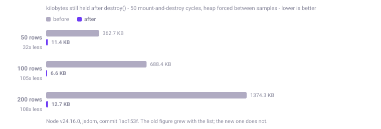
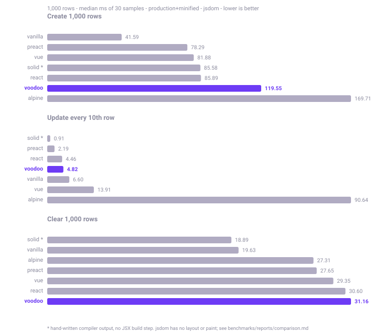

<div align="center">


### O framework JavaScript HTML-first.

**Construa aplicações reativas direto no HTML.**

Sem passo de build obrigatório · Sem dependências em tempo de execução · Sem Virtual DOM · Sem configuração

[](https://github.com/kwy404/Voodoo.js/actions/workflows/ci.yml)
[](LICENSE)
[](#typescript)
[](packages/voodoojs/dist/voodoo.min.js)


*JavaScript feels like magic.*

[Instalação](#instalação) · [Início rápido](#início-rápido) · [Documentação](#documentação) · [Exemplos](#exemplos) · [English](README.md)

</div>

---

## A versão de 30 segundos

Salve este arquivo. Abra no navegador. Funciona.

```html
<script src="voodoo.min.js" defer></script>

<div v-data="{ contador: 0 }">
  <button @click="contador--">-</button>
  <strong>{ contador }</strong>
  <button @click="contador++">+</button>
</div>
```

Sem bundler, sem `npm install`, sem arquivo de configuração, sem JSX. Só HTML que pensa.

### A mesma ideia, fazendo trabalho de verdade

Estado reativo, uma requisição HTTP ao vivo, um formulário validado e uma notificação — ainda em
uma tag de script, ainda sem passo de build:

```html
<div v-data="{ }">

  <!-- Uma requisição com estado próprio de carregamento, erro e dados, declarada no HTML -->
  <div v-resource="usuarios: /api/usuarios">
    <p v-if="usuarios.loading">Carregando…</p>
    <p v-else-if="usuarios.error">{ usuarios.error.message }</p>
    <ul v-else>
      <li v-for="u in usuarios.data" :key="u.id">{ u.nome }</li>
    </ul>
    <button @click="usuarios.reload()">Atualizar</button>
  </div>

  <!-- Um formulário que valida, envia por AJAX e devolve o resultado -->
  <form v-submit="/api/usuarios" v-method="POST" v-validate
        v-toast-success="Usuário criado" v-reset-success>
    <input name="nome" v-required>
    <input name="email" type="email" v-required v-email>
    <button type="submit" :disabled="$form.loading">
      { $form.loading ? 'Salvando…' : 'Salvar' }
    </button>
  </form>

</div>
```

Essa é a aplicação inteira. Não existe um `app.js` ao lado fazendo a ligação.

## O que é a Voodoo?

React e Vue começam pelo JavaScript: você descreve a interface em uma linguagem de componentes, e o
HTML é o que o framework produz no final.

**A Voodoo começa pelo HTML.** A página que você já tem *é* a aplicação. Você acrescenta atributos a
ela, cada atributo é ligado ao estado reativo, e quando esse estado muda apenas os nós do DOM que
dependem dele são atualizados — nada mais é tocado, e não existe Virtual DOM no meio do caminho.

Quando o HTML não basta, a API `V` está ali: `V.reactive`, `V.component`, `V.http`, `V.store`,
`V.router` e uma coleção de DOM encadeável através de `V('#seletor')`. Se preferir, dá para
escrever a aplicação inteira em JavaScript com `V.createApp().mount('#app')`. É o mesmo runtime, e
os dois modos convivem livremente na mesma página.

Isto não é um "matador de React". É um ponto de partida diferente para um tipo de projeto
diferente: painéis administrativos gerados no servidor, sites de conteúdo, protótipos, páginas
legadas e qualquer coisa em que montar um pipeline de build custa mais do que o problema que você
está resolvendo.

## Por que a Voodoo?

- **HTML-first.** O comportamento fica ao lado da marcação a que pertence. Um arquivo, não três.
- **Reatividade granular.** `reactive` / `ref` / `computed` / `effect` sobre Proxy. Uma escrita
  reexecuta apenas os efeitos que de fato leram aquele valor.
- **Sem passo de build obrigatório.** Uma tag `<script>` já é a instalação completa. O build existe
  quando você quiser, nunca por obrigação.
- **Zero dependências em tempo de execução.** Os bundles de navegador não carregam nada além da
  própria Voodoo.
- **Atualização direta do DOM.** Sem Virtual DOM, sem passo de diff, sem heurística de
  reconciliação.
- **Parser de expressões seguro.** As expressões dos atributos passam por um lexer de verdade, um
  parser Pratt e um interpretador de AST. Sem `eval`, sem `new Function` — por isso a Voodoo roda
  sob uma Content Security Policy sem `unsafe-eval`.
- **Melhoria progressiva.** A Voodoo nunca toma conta da página: ela enriquece os elementos que
  você marca e deixa o resto em paz, então entra em bases de código existentes sem reescrita.
- **Tudo incluído.** Reatividade, componentes, roteador, HTTP, formulários, validação, máscaras,
  interface, arrastar e soltar, animação, gráficos, i18n e stores vêm na caixa — e não em doze
  pacotes.
- **TypeScript.** O código inteiro é TypeScript e todo ponto de entrada publica declarações.
- **Ferramentas opcionais.** Existe uma CLI para criar projetos e builds sob medida. Você nunca é
  obrigado a usar.

## Duas formas de escrever

**Modo 1 — HTML.** Estado declarado onde ele é usado:

```html
<div v-data="{ contador: 0 }">
  <button @click="contador++">Cliques: { contador }</button>
</div>
```

**Modo 2 — JavaScript.** O mesmo motor de reatividade, guiado pelo seu código:

```js
const estado = V.reactive({ contador: 0 })
V.effect(() => { document.title = `Cliques: ${estado.contador}` })
estado.contador++
```

## Tudo incluído

Cada linha abaixo faz parte do runtime publicado.

| Pilar | O que você tem |
| --- | --- |
| **Reatividade** | `reactive`, `ref`, `computed`, `effect`, `watch`, `watchEffect`, `nextTick`, `effectScope`, `flushSync` |
| **Expressões** | Lexer + parser Pratt + interpretador de AST próprios. Sem `eval`, compatível com CSP |
| **Directives** | Texto, condicionais, listas, ligação, classes, estilos, eventos, refs, transições e mais |
| **Componentes** | Props, estado, computados, métodos, watchers, template, estilo próprio, slots nomeados, `provide`/`inject`, ciclo de vida |
| **Modo aplicação** | `V.createApp({…}).mount('#app')` com `use`, `provide`, componentes locais e `unmount` |
| **DOM** | Coleção encadeável via `V('#seletor')`, mais utilitários de transição |
| **HTTP** | Interceptors, timeout, retry exponencial, cache, CSRF, progresso de upload, SSE, stream NDJSON, fila offline |
| **Requisições declarativas** | `v-get`/`v-post`/`v-put`/`v-patch`/`v-delete`, `v-resource`, `v-load`, `v-load-visible`, `v-search`, polling |
| **Formulários** | Envio por AJAX, serialização, upload, dropzone, autosave, aviso ao sair, estado reativo `$form` |
| **Validação e máscaras** | Conjunto completo de regras, regras assíncronas, regras e mensagens próprias, máscaras de entrada |
| **Stores** | `V.store(nome, def, { persist })` e a mágica `$store`, com persistência opcional no `localStorage` |
| **Armazenamento** | `storage`, `session`, `cookie`, `cache`, `url`, `theme` |
| **Interface** | Toast, modal, alert, confirm, prompt, dialog, paleta de comandos, mais directives de abas, dropdown, tooltip, gaveta, popover e acordeão |
| **Arrastar e soltar** | `v-draggable`, `v-droppable`, `v-sortable`, grupos, suporte a teclado |
| **Roteador** | Modos history e hash, params, query, guards, restauração de rolagem, cache de view, `v-link`, `v-router-view`, rotas dinâmicas |
| **i18n** | Mensagens por idioma, `V.t`, `v-t`, pluralização, troca de idioma em tempo de execução |
| **Animação** | Física de mola, stagger, `inView`, progresso de rolagem, presets |
| **Gráficos** | Desenhados em SVG puro, sem dependência de biblioteca de gráficos |
| **Tempo real** | `V.socket` com WebSocket nativo e protocolo Socket.IO, salas publicas e privadas, reconexao com espera progressiva, heartbeat e fila de envio. Declarativo com `v-socket`, `v-room` e `v-on-socket:` |
| **GPU** | `V.gpu` sobre WebGPU com reflexao de WGSL, e a directive `v-shader`. Sem WebGPU, cai no conteudo alternativo do canvas |
| **Devtools** | Inspetor de reatividade `V.xray` e um barramento de eventos |
| **CLI** | `@voodoo/cli`: `init`, `build --modules=…`, `add`, `info` |

## Instalação

> **Sobre o npm.** O pacote `voodoojs` ainda não foi publicado no registro do npm. As instruções de
> npm e CDN abaixo estão escritas para o momento em que ele for. Até lá, use o download direto ou
> um build local — os dois funcionam hoje.

**Download direto, ou build local — os dois funcionam agora**

```bash
curl -O https://github.com/kwy404/Voodoo.js/raw/main/packages/voodoojs/dist/voodoo.min.js
# ou
git clone https://github.com/kwy404/Voodoo.js.git
cd Voodoo.js && npm install && npm run build   # os bundles saem em packages/voodoojs/dist/
```

```html
<script src="voodoo.min.js" defer></script>
```

**CDN direto do repositório (funciona agora)**

```html
<script src="https://cdn.jsdelivr.net/gh/kwy404/Voodoo.js@main/packages/voodoojs/dist/voodoo.min.js" defer></script>
```

**CDN, npm e ES Modules (quando publicado)**

Os caminhos de CDN apoiados no npm abaixo ainda não resolvem, porque o pacote não está no registro.

```html
<script src="https://cdn.jsdelivr.net/npm/voodoojs/dist/voodoo.min.js" defer></script>
<script src="https://unpkg.com/voodoojs/dist/voodoo.min.js" defer></script>
```

```js
// npm install voodoojs   (planejado, ainda não está no registro)
import V from 'voodoojs'
V.start()

// ou importe só o que precisa — pontos de entrada separados, em ESM e CJS, com tipos
import { reactive, computed } from 'voodoojs/reactivity'
import { http } from 'voodoojs/http'
import { debounce } from 'voodoojs/utils'
```

**CLI**

```bash
npx voodoo init minha-pagina                     # cria um projeto pronto para abrir
npx voodoo build --modules=core,directives,http  # bundle sob medida, só com o que você usa
npx voodoo add card                              # copia um componente para o seu projeto
npx voodoo info                                  # lista os módulos e o tamanho de cada um
```

**Qual bundle escolher?**

| Arquivo | O que vem dentro |
| --- | --- |
| `voodoo.core.min.js` | Build mínimo: reatividade, expressões, directives, componentes, DOM, requisições |
| `voodoo.min.js` | **Build essencial — o padrão.** Soma formulários, validação, máscaras, interface, arrastar e soltar |
| `voodoo.full.min.js` | Tudo: gráficos, animação, roteador, i18n, devtools, componentes prontos |

Os tamanhos são dinâmicos — veja o badge acima, ou rode `npm run size` / `npx voodoo info`.

## Início rápido

**Estado, eventos e ligação de dois sentidos.** A interpolação usa chave simples:
`{ expressão }`. `{{ expressão }}` também é aceita, para quem vem do Vue.

```html
<div v-data="{ nome: 'Mundo', email: '' }">
  <p>Olá, { nome }!</p>
  <button @click="nome = 'Voodoo'">Trocar</button>

  <input v-model="email" type="email">
  <p v-show="email">Você digitou: { email }</p>
</div>
```

**Condicionais, listas, classes e estilos.**

```html
<div v-data="{ status: 'pronto', itens: ['um', 'dois'], largura: 60 }">
  <p v-if="status === 'carregando'">Carregando…</p>
  <p v-else-if="status === 'erro'">Alguma coisa deu errado.</p>
  <p v-else>Pronto.</p>

  <li v-for="(item, i) in itens" :key="i">{ i + 1 }. { item }</li>

  <span :class="{ 'ativo': status === 'pronto' }" :style="{ width: largura + '%' }"></span>
</div>
```

**HTTP sem escrever fetch, e um componente.**

```html
<button v-get="/api/estatisticas" v-target="#painel" v-swap="innerHTML">Carregar</button>
<div id="painel"></div>

<script>
  V.component('cartao-usuario', {
    props: { nome: { type: 'string', default: 'Anônimo' } },
    template: `<div class="cartao"><strong v-text="nome"></strong></div>`
  })
</script>

<cartao-usuario nome="Ada"></cartao-usuario>
```

## Componentes

Um componente é um escopo com estado, métodos, computados, watchers, props, slots e ciclo de vida,
montado sobre um elemento. Sem passo de compilação, sem formato de arquivo único.

```js
V.component('contador', {
  props: {
    inicio: { type: 'number', default: 0 },
    rotulo: { type: 'string', required: true }
  },

  state(props) { return { valor: props.inicio } },

  computed: { dobro() { return this.valor * 2 } },

  methods: {
    somar() {
      this.valor++
      this.emit('mudou', this.valor)   // um CustomEvent de verdade, que sobe pela árvore
    }
  },

  watch: { valor(v) { console.log('agora', v) } },

  template: `
    <button @click="somar()">{ rotulo }: { valor }</button>
    <small>dobro: { dobro }</small>
    <slot name="rodape"></slot>
  `,

  style: `.contador { font-weight: 600 }`,

  mounted() { /* o elemento já está no DOM */ }
})
```

Três formas equivalentes de usar, e ouvir o que ele emite é um listener comum:

```html
<div v-component="contador" rotulo="Cliques"></div>
<contador rotulo="Cliques" :inicio="10" @mudou="console.log($event.detail)"></contador>
<Contador rotulo="Cliques"></Contador>
```

Atributos estáticos viram props de texto, convertidas para o `type` declarado. Atributos escritos
com `:` são ligações reativas avaliadas no escopo do pai, e o conteúdo dos slots também; slots
nomeados casam por `slot="nome"`. Dentro da instância você ainda tem `$el`, `$props`, `$refs`,
`$parent`, `$name`, `$emit`, `$watch` e `$nextTick`, mais `provide` / `inject` para injeção de
dependência.

**Modo aplicação** — se preferir descrever tudo em JavaScript:

```js
V.createApp({
  data: () => ({ n: 0 }),
  computed: { dobro() { return this.n * 2 } },
  methods: { somar() { this.n++ } },
  template: `<button @click="somar()">Cliques: { n }</button><p>Dobro: { dobro }</p>`
}).mount('#app')
```

O `mount` aceita um alvo que ainda não existe — ele espera, então não há corrida com o carregamento
da página. O `unmount` devolve o HTML original do container em vez de deixá-lo vazio.

## HTTP

**Declarativo.** Ligue uma requisição a um elemento e diga para onde vai a resposta:

```html
<button v-get="/api/relatorio" v-target="#saida" v-swap="innerHTML">Carregar</button>

<button v-delete="'/api/usuarios/' + usuario.id"
        v-confirm="Excluir este usuário?"
        v-toast-success="Usuário excluído">Excluir</button>

<div v-get="/api/feed" v-trigger="visible" v-poll="30s"></div>

<input v-search="/api/busca" v-param="q" v-debounce="300ms" v-target="#resultados">
```

A URL pode ser um literal (`/api/usuarios`) ou uma expressão (`'/api/usuarios/' + id`). Os
atributos de apoio incluem `v-target`, `v-swap`, `v-trigger`, `v-poll`, `v-body`, `v-params`,
`v-headers`, `v-cache`, `v-retry`, `v-timeout`, `v-json-path`, `v-template`, `v-offline-queue`,
`v-redirect`, `v-scroll-to`, `v-toast-success`, `v-toast-error`, `v-on-success`, `v-on-error` e
`v-on-complete`.

O `v-resource` é a versão que entrega o estado da requisição como dado reativo em vez de trocar
HTML. Ele expõe `data`, `loading`, `error`, `loaded`, `reload()` e `set()` — veja a demonstração no
começo deste arquivo.

**Programático.**

```js
const usuarios = await V.http.get('/api/usuarios')
const criado   = await V.http.post('/api/usuarios', { nome: 'Ada' })

// Resposta completa, com status e cabeçalhos
const res = await V.http.request({ url: '/api/usuarios', retry: 2, timeout: 5000, cache: 60000 })

// Upload com progresso real
await V.http.upload('/api/arquivos', formData, { onProgress: (pct) => console.log(pct + '%') })

// Server-Sent Events e stream NDJSON
V.http.sse('/api/eventos', { message: (dados) => console.log(dados) })
await V.http.stream('/api/tokens', (linha) => console.log(linha))
```

Padrões, interceptors, URL base, cabeçalho de CSRF e cache ficam em `V.http.defaults` e
`V.http.interceptors`.

## Formulários

Enviar, validar, mostrar o carregamento e reportar o resultado — tudo declarado no próprio
formulário:

```html
<form v-submit="/api/contato" v-method="POST" v-validate
      v-toast-success="Mensagem enviada" v-toast-error="Não foi possível enviar" v-reset-success>

  <input name="nome" v-required>
  <input name="email" type="email" v-required v-email>
  <input name="telefone" v-mask="phone">
  <textarea name="mensagem" v-minlength="20"></textarea>

  <p v-if="$form.errors.email">{ $form.errors.email }</p>

  <button type="submit" :disabled="$form.loading">
    { $form.loading ? 'Enviando…' : 'Enviar' }
  </button>
</form>
```

`$form` é reativo e carrega `loading`, `saving`, `success`, `errors`, `message`, `data`, `status`,
`dirty` e `progress`. O conjunto de regras cobre o esperado — `required`, `email`, `url`, `number`,
`min`, `max`, `minlength`, `maxlength`, `between`, `match`, `regex`, `date`, `same`, `different`,
`in`, `strongpassword`, `cpf`, `cnpj`, `cep` e mais — além de regras assíncronas e das suas
próprias, via `V.validator()`.

## Construindo aplicações completas

A Voodoo cresce além de uma página sem mudar o modelo.

- **Componentes** — registre uma vez, use como tag em qualquer lugar da página.
- **Stores** — `V.store('carrinho', { itens: [] }, { persist: true })`, lido em qualquer lugar como
  `$store.carrinho`.
- **Roteador** — `V.router({ mode: 'history', routes: { '/usuarios/:id': { component: 'pagina-usuario' } } })`,
  com guards, params, comportamento de rolagem, `v-link` e `v-router-view`.
- **Plugins** — `V.use(plugin)` ou `app.use(plugin)` para registrar directives, componentes e
  serviços.
- **Carregamento sob demanda** — `v-load-visible` e rotas com `view` buscam o HTML só quando ele é
  necessário.
- **i18n** — `V.i18n({ locale: 'pt-BR', messages })`, depois `v-t` na marcação e `V.t()` no código.

Cada um deles tem o seu guia em [`docs/`](docs/).

## DevTools

O build completo traz o `xray`, um inspetor visual de reatividade: ele mostra a árvore de escopos,
o estado ao vivo, quais efeitos estão rodando, e os registros de eventos e de rede.

```js
V.xray()        // alterna o painel
V.xray(true)    // abre
V.xray(false)   // fecha

V.enableXrayShortcut()   // instala apenas o atalho, sem abrir o painel
```

A primeira chamada também instala o atalho `Ctrl+Shift+X`, então o inspetor fica a uma tecla de
distância durante o desenvolvimento, sem custo nenhum enquanto ninguém aperta.

## Arquitetura

```
  atributos HTML ─▶  Walker + MutationObserver      acha os atributos v-*, monta os escopos
                            │
  expressões     ─▶  Lexer → parser Pratt → interpretador de AST   sem eval, sem new Function
                            │
                     Reatividade: alvos em Proxy + efeitos   leituras rastreadas, escritas na fila
                            │
                     Directives atualizam os nós reais do DOM   sem Virtual DOM, sem diff

  Por cima: componentes · stores · roteador · HTTP · formulários · interface · i18n · animação · gráficos
```

A versão longa, com as fronteiras de cada módulo e o modelo de escopos, está em
[`ARCHITECTURE.md`](ARCHITECTURE.md).

## Desempenho

Os benchmarks são reproduzíveis: versões de dependência fixadas, builds de produção, metodologia
publicada e ambiente registrado. O relatório completo — incluindo os casos em que a Voodoo *perde*
— está em [`benchmarks/README.md`](benchmarks/README.md), com a metodologia, o ambiente e como
reproduzir cada medição.

O JavaScript puro é o teto aqui, e a Voodoo cobra um custo real pela produtividade que entrega. A
função destes números é mostrar o tamanho desse custo, não fingir que ele é zero.

**Desmontar uma lista com chave.** O perfil mostrou que o `destroy()` lia `node.childNodes`, uma
coleção viva que o DOM reconstrói a cada acesso e invalida a cada mudança na árvore. Trocar por
travessia entre irmãos cortou cerca de um terço do custo de limpar uma lista grande:



Medido no Node 24 com jsdom, medianas de execuções repetidas, em uma máquina só. Leia como a forma
da mudança, e não como número absoluto: o seu navegador não é o jsdom. A metodologia completa está
em [`benchmarks/README.md`](benchmarks/README.md).

Uma ressalva honesta da mesma medição: a *criação* da lista nesse tamanho é dominada pelo próprio
DOM. Inserir 4.000 nós sem framework nenhum levou mais tempo no jsdom do que a renderização inteira
da Voodoo, então os números de criação dizem mais sobre o ambiente do que sobre o framework.

**Comparação com outros frameworks.** Sete implementações da mesma lista de 1.000 linhas,
todas empacotadas em produção e minificadas, rodando em sequência no mesmo processo contra o
mesmo documento jsdom. Depois de cada cenário o DOM de cada framework é reduzido à lista de
textos dos `<li>` e comparado com o vanilla escrito à mão: quem produzir saída diferente é
excluído, e não creditado com um tempo rápido.



Mediana de 30 amostras, em milissegundos, menor é melhor. Voodoo.js em negrito:

| | criar 1k | atualizar 1 em 10 | limpar 1k | minificado |
| --- | ---: | ---: | ---: | ---: |
| vanilla JS | 41,59 | 6,60 | 19,63 | 0,6 KB |
| Solid 1.9.15 | 85,58 | 0,91 | 18,89 | 16,7 KB |
| Preact 10.29.8 | 78,29 | 2,19 | 27,65 | 10,7 KB |
| React 19.2.8 | 85,89 | 4,46 | 30,60 | 189,3 KB |
| Vue 3.5.42 | 81,88 | 13,91 | 29,35 | 62,5 KB |
| Alpine 3.17.1 | 169,71 | 90,64 | 27,31 | 55,2 KB |
| **Voodoo.js** | **119,55** | **4,82** | **31,16** | **412,4 KB** |

Lendo com honestidade. Na atualização a Voodoo fica na mesma faixa do vanilla escrito à mão e é
cerca de **19x mais rápida que o Alpine**, que é a comparação justa: o Alpine também é HTML-first
e também interpreta expressões em tempo de execução, em vez de compilá-las. Esse número de
atualização teve **coeficiente de variação de 49,1%**, então é uma faixa, não uma classificação —
não estamos afirmando ganhar do vanilla com base numa amostra ruidosa.

Na criação a Voodoo é **sexta de sete**, à frente do Alpine mas atrás de todos os frameworks
compilados e de Virtual DOM. Na limpeza é a **última**. Nenhum dos dois é bom resultado, e nenhum
está escondido aqui.

O Solid ganha a atualização com folga larga porque um compilador gera o caminho de atualização
dele. A Voodoo não tem passo de build, e essa é a troca que ela faz.

Vale dizer com todas as letras: **a Voodoo é de longe o maior bundle desta tabela.** Se tamanho é
a sua principal restrição, Alpine e Preact são a recomendação honesta. O método, os adaptadores de
cada framework e as estatísticas completas estão em
[`benchmarks/reports/comparison.md`](benchmarks/reports/comparison.md); o jsdom não tem layout nem
pintura, então leia isto como formato relativo, e não como verdade absoluta.

**Tamanho dos bundles**, medido sobre os builds versionados em `8e765d2`:

| Build | Minificado | Gzip | Brotli |
| --- | --- | --- | --- |
| `voodoo.core.min.js` | 129.68 KB | 45.04 KB | 39.50 KB |
| `voodoo.min.js` | 252.04 KB | 81.66 KB | 69.30 KB |
| `voodoo.full.min.js` | 424.28 KB | 128.37 KB | 107.08 KB |

Rode você mesmo: o arcabouço de medição e as versões exatas testadas estão em
[`benchmarks/`](benchmarks/).

## Comparação

Uma comparação honesta. Toda ferramenta aqui é boa naquilo para que foi desenhada.

| | Voodoo.js | Alpine.js | HTMX | Vue 3 | React | jQuery |
| --- | --- | --- | --- | --- | --- | --- |
| Ponto de partida | HTML | HTML | HTML | JavaScript | JavaScript | JavaScript |
| Roda por uma tag de CDN | nativo | nativo | nativo | nativo | nativo | nativo |
| Passo de build | possível | possível | possível | recomendado | recomendado | possível |
| Renderização | DOM direto | DOM direto | HTML do servidor | Virtual DOM | Virtual DOM | manual |
| Estado reativo | nativo | nativo | — | nativo | nativo | — |
| Componentes | nativo | via pacote do ecossistema | — | nativo | nativo | — |
| Cliente HTTP | nativo | via pacote do ecossistema | nativo | via pacote do ecossistema | via pacote do ecossistema | nativo |
| Formulários + validação | nativo | via pacote do ecossistema | via pacote do ecossistema | via pacote do ecossistema | via pacote do ecossistema | via pacote do ecossistema |
| Roteador | nativo | via pacote do ecossistema | via pacote do ecossistema | via pacote do ecossistema | via pacote do ecossistema | via pacote do ecossistema |
| Interface (toast, modal, abas) | nativo | via pacote do ecossistema | via pacote do ecossistema | via pacote do ecossistema | via pacote do ecossistema | via pacote do ecossistema |
| Gráficos / i18n | nativo | via pacote do ecossistema | via pacote do ecossistema | via pacote do ecossistema | via pacote do ecossistema | via pacote do ecossistema |
| Renderização no servidor | — | — | nativo (quem renderiza é o servidor) | nativo | nativo | — |
| Tamanho do ecossistema | jovem | crescendo | crescendo | grande | muito grande | muito grande |

A diferença real é filosófica. O **HTMX** diz que o HTML é do servidor e o navegador apenas o
encaixa. O **Alpine** dá ao HTML uma pitada de estado reativo e para por aí, de propósito. **Vue e
React** pedem que você descreva a interface em JavaScript e geram o HTML. A **Voodoo** mantém o
HTML como fonte da verdade *e* entrega a caixa de ferramentas completa — assim você raramente
precisa sair dele, e a API `V` espera pelos momentos em que precisar.

## Quando usar a Voodoo

Encaixa bem em: painéis administrativos gerados no servidor (Laravel, Rails, Django, Spring, PHP
puro); sites de conteúdo e landing pages que precisam de comportamento sem um pipeline de
front-end; protótipos, em que abrir um arquivo vale mais do que qualquer arquitetura; times
pequenos que não querem manter um build só para mostrar uma tabela; páginas legadas, em que a
Voodoo convive com o código existente porque nunca toma conta do documento; e aplicações de página
única completas, com componentes, stores e roteador.

### Limitações atuais

Ditas com clareza, para que nada surpreenda depois:

- **Sem renderização no servidor nem hidratação.** A Voodoo roda no navegador. Os módulos puros
  (reatividade, HTTP, utilitários) funcionam em Node, mas não existe hidratação.
- **Sem alvo nativo em celular.** Não existe equivalente ao React Native.
- **Ecossistema jovem.** Menos plugins de terceiros, integrações e respostas na internet do que os
  frameworks estabelecidos. Essa distância é real e leva tempo para diminuir.
- **Integrações de terceiros limitadas.** Bibliotecas de componentes e ferramentas feitas para
  React ou Vue não vêm junto.
- **Sem tipagem estática dentro dos templates.** As expressões dos atributos são texto; os erros
  aparecem em tempo de execução, não de compilação.
- **Sem virtualização de listas.** O `v-for` reaproveita elementos por chave, mas listas muito
  grandes ainda renderizam todas as linhas.

## Documentação

A documentação existe em dois idiomas: português em [`docs/`](docs/) (completa) e inglês em
[`docs/en/`](docs/en/).

| Onde | O quê |
| --- | --- |
| [`docs/`](docs/) | Índice do guia completo e da referência |
| [`docs/introducao.md`](docs/introducao.md) | O que é, para quem serve, quando não usar |
| [`docs/instalacao.md`](docs/instalacao.md) | Bundles, CDN, npm, configuração pela tag script |
| [`docs/inicio-rapido.md`](docs/inicio-rapido.md) | Do arquivo vazio ao primeiro app |
| [`docs/directives.md`](docs/directives.md) | Referência completa de directives |
| [`docs/api.md`](docs/api.md) | Referência completa da API `V` |
| [`site/`](site/) | Código do site de documentação |

## Exemplos

Cada exemplo é um único arquivo HTML que você pode abrir direto no navegador. Comece por
[`examples/index.html`](examples/index.html), ou sirva o repositório inteiro e navegue por eles:

```bash
npm run build && npm run serve
# depois abra http://localhost:5173/examples/
```

O mesmo servidor também hospeda o site da documentação e o playground ao vivo em
[`site/index.html`](site/index.html) (`http://localhost:5173/site/#playground`), onde dá para editar
marcação Voodoo e ver rodando na hora.

**Aplicações**

| Exemplo | O que mostra |
| --- | --- |
| [Tarefas](examples/todo/) | Estado, listas, edição no lugar, filtros, reordenação |
| [CRUD](examples/crud/) | Um componente, formulários, validação, máscaras, toasts, atualização otimista |
| [Painel](examples/dashboard/) | Gráficos, valores computados reativos, atualização periódica |
| [Kanban](examples/kanban/) | Arrastar e soltar entre colunas, estado persistido |
| [Chat](examples/chat/) | Atualização ao vivo, comportamento de rolagem, composição de mensagem |
| [Chat em tempo real](examples/chat-tempo-real/) | `v-socket` e `v-room` sobre WebSocket de verdade, salas públicas, mensagem privada, presença e volta automática às salas depois de reconectar. Vem com um servidor de teste sem dependência |
| [E-commerce](examples/ecommerce/) | Catálogo, filtros, store do carrinho, fluxo de compra |
| [Pokédex](examples/pokedex/) | Consumo de API real, busca, paginação, carregamento sob demanda |
| [DevTools](examples/devtools/) | Ligar o inspetor por um único atributo na tag do script |

**Gráficos e jogos**

Eles existem para provar um ponto: a interface inteira é Voodoo declarativo, e o canvas cuida só do
que realmente precisa de canvas.

| Exemplo | O que mostra |
| --- | --- |
| [Mundo aberto 3D](examples/mundo-aberto/) | Uma cidade gerada por código em WebGL2 puro, sem biblioteca nenhuma. Ciclo de dia e noite, sombras, névoa, minimapa e velocímetro, com o HUD e os controles ao vivo escritos como marcação Voodoo comum |
| [Breakout](examples/jogos/breakout/) | Cinco níveis, cápsulas de poder que caem, combo, vidas, recorde persistido e som. Jogável por teclado e por toque |
| [Tetris](examples/jogos/tetris/) | Saco de sete peças, peça fantasma, guardar peça, wall kick. O tabuleiro é canvas; a fila de próximas é uma grade de spans feita por `v-for` aninhado |
| [Shaders](examples/shaders/) | Quatro cenas de raymarching em WebGL2 — Mandelbulb, túnel infinito, metaballs e oceano — com o painel de controle inteiro gerado por `v-for` sobre os uniforms de cada cena, e `v-model` ligado direto na GPU |

## Ecossistema

| Pacote | Para que serve |
| --- | --- |
| [`voodoojs`](packages/voodoojs/) | O framework: runtime, directives, componentes, HTTP, formulários, interface, roteador, i18n |
| [`@voodoo/cli`](packages/cli/) | Criação de projetos, builds sob medida, cópia de componentes, informação de módulos |

## TypeScript

O código inteiro é TypeScript, e todo ponto de entrada publica declarações `.d.ts`.

```ts
import V, { reactive, computed, type HttpResponse } from 'voodoojs'

const estado = reactive({ contador: 0 })
const dobro = computed(() => estado.contador * 2)
```

## Roadmap

O foco de curto prazo é a documentação em inglês, mais exemplos, uma superfície maior de plugins e
a publicação no npm. O plano acompanhado fica em [`ROADMAP.md`](ROADMAP.md); o que já foi entregue
está registrado no [`CHANGELOG.md`](CHANGELOG.md).

## Contribuindo

```bash
git clone https://github.com/kwy404/Voodoo.js.git
cd Voodoo.js && npm install
```

Um monorepo com npm workspaces: [`packages/voodoojs`](packages/voodoojs/) é o framework,
[`packages/cli`](packages/cli/) é a CLI, mais [`docs/`](docs/), [`site/`](site/) e
[`examples/`](examples/).

| Comando | O que faz |
| --- | --- |
| `npm test` | Roda a suíte inteira uma vez (vitest + jsdom) |
| `npm run test:watch` | A mesma suíte, reexecutando enquanto você edita |
| `npm run coverage` | Rodada de testes com relatório de cobertura |
| `npm run typecheck` | `tsc --noEmit` sobre o pacote do framework |
| `npm run build` | Gera todos os bundles do `voodoojs` e do `@voodoo/cli` |
| `npm run size` | Informa o tamanho de cada bundle gerado |
| `npm run serve` | Servidor estático local para os exemplos e o site |
| `npm run format` | Prettier sobre o repositório |

Novos scripts entram com o tempo — o `package.json` da raiz é a lista definitiva.

**O ciclo.** Crie um branch a partir da `main`, faça a mudança, rode `npm test` e
`npm run typecheck` antes de abrir o PR, e escreva as mensagens de commit no estilo
[Conventional Commits](https://www.conventionalcommits.org/) (`fix:`, `feat:`, `docs:`). O CI
([`.github/workflows/ci.yml`](.github/workflows/ci.yml)) roda typecheck, testes, build e a
checagem de tamanho dos bundles no Node 20 e no 22.

**Onde mexer.** Bug no runtime → `src/runtime/`. Reatividade → `src/reactivity/`. Expressões →
`src/parser/`. Directive nova → `src/directives/`. Componente de interface → `src/ui/`.
Documentação → `docs/` e `site/docs/`.

### Como acrescentar uma directive

As directives internas são registradas com `defineDirective(nome, setup, { priority, terminal })`,
de `src/runtime/registry.ts`, no arquivo correspondente dentro de `src/directives/`. A função
`setup` recebe um `DirectiveContext` com `el`, `scope`, `expression`, `arg`, `modifiers`,
`evaluate()`, `effect()`, `cleanup()` e `walk()`. O `priority` define a ordem de execução (maior
roda primeiro, veja a tabela `PRIORITY`); `terminal: true` impede o walker de descer nos filhos,
como fazem o `v-for` e o `v-if`.

```ts
import { defineDirective } from '../runtime/registry';

// <p v-shout="mensagem">  →  mostra o valor em caixa alta
defineDirective('shout', ({ el, effect, evaluate, cleanup }) => {
  effect(() => {
    el.textContent = String(evaluate() ?? '').toUpperCase();
  });

  // Sempre libere o que você prendeu: listeners, timers, observers.
  const aoClicar = () => el.classList.toggle('alto');
  el.addEventListener('click', aoClicar);
  cleanup(() => el.removeEventListener('click', aoClicar));
});
```

Essa é a API interna. A pública é `V.directive(nome, hooks)`, que embrulha o mesmo mecanismo em
hooks de ciclo de vida no estilo do Vue (`created`, `mounted`, `updated`, `unmounted`) e entrega a
cada hook um `binding` com o `value` já avaliado, `oldValue`, `arg` e `modifiers`. Use
`V.directive` no código da aplicação; use `defineDirective` dentro do framework.

### Como acrescentar um teste

Os testes ficam em [`packages/voodoojs/test/`](packages/voodoojs/test/) como `*.test.ts`, e rodam
em vitest com jsdom. Um teste de directive monta o HTML, percorre com um escopo e verifica o DOM:

```ts
import { describe, it, expect } from 'vitest';
import { reactive, nextTick } from '../src/reactivity';
import { Scope } from '../src/runtime/scope';
import { walk } from '../src/runtime/walker';
import '../src/core';

describe('v-shout', () => {
  it('mostra o valor em caixa alta', async () => {
    const dados = reactive({ mensagem: 'ola' });
    const raiz = document.createElement('div');
    raiz.innerHTML = '<p v-shout="mensagem"></p>';
    document.body.appendChild(raiz);
    walk(raiz, new Scope(dados));

    expect(raiz.textContent).toBe('OLA');

    dados.mensagem = 'tchau';
    await nextTick();
    await nextTick();
    expect(raiz.textContent).toBe('TCHAU');
  });
});
```

**A regra de ouro: toda correção de bug entra junto com um teste de regressão.** Se quebrou uma
vez pode quebrar de novo, e o teste é o que impede.

O detalhe completo está no [`CONTRIBUTING.md`](CONTRIBUTING.md), e todo mundo deve seguir o
[`CODE_OF_CONDUCT.md`](CODE_OF_CONDUCT.md).

## Licença

[MIT](LICENSE) © contribuidores da Voodoo.js.

---

<div align="center">

**Prefer to read in English?** → [README.md](README.md)

<sub>JavaScript feels like magic.</sub>

</div>
